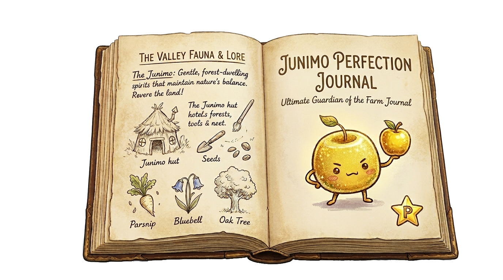

# Junimo Perfection Journal

A cozy Stardew Valley perfection tracker for everything standing between a farm and true perfection. This repo holds the web version.

```text
#####  #   #  #   #  #####  #   #   ###   
   #   #   #  ##  #    #    ## ##  #   #  
   #   #   #  # # #    #    # # #  #   #  
#  #   #   #  #  ##    #    #   #  #   #  
 ##     ###   #   #  #####  #   #   ###   

####   #####  ####   #####  #####   ####  #####  #####   ###   #   #  
#   #  #      #   #  #      #      #        #      #    #   #  ##  #  
####   ####   ####   ####   ####   #        #      #    #   #  # # #  
#      #      #  #   #      #      #        #      #    #   #  #  ##  
#      #####  #   #  #      #####   ####    #    #####   ###   #   #  

#####   ###   #   #  ####   #   #   ###   #      
   #   #   #  #   #  #   #  ##  #  #   #  #      
   #   #   #  #   #  ####   # # #  #####  #      
#  #   #   #  #   #  #  #   #  ##  #   #  #      
 ##     ###    ###   #   #  #   #  #   #  #####  
```



## Try It

- Live site: [dantasqu.github.io/junimo-perfection-journal](https://dantasqu.github.io/junimo-perfection-journal/)
- Local version: open `index.html` in a browser
- Progress saves in the browser on each device

## Inside the Tracker

- fish
- cooking
- crafting
- shipping
- friendships
- monster slayer goals
- skills, stardrops, golden walnuts, obelisks, and the Gold Clock
- import/export and local progress tracking

## Repo Layout

- `index.html`: app shell
- `styles.css`: Stardew-inspired UI styling
- `app.js`: tracker logic, rendering, save/import/export behavior
- `data/`: bundled wiki-derived tracker data
- `branding/current/`: current approved artwork
- `branding/site/`: artwork used by the live site UI
- `branding/social/`: GitHub/social preview exports
- `branding/concepts/`: alternate drafts and experiments
- `branding/references/`: Stardew and layout references
- `CHANGELOG.md`: release history

## Notes

- This repo is currently a static front-end hosted with GitHub Pages.
- If we ever want accounts, shared saves, or cloud sync, we can move to a backend later.
- Some images inside the tracker load from Stardew Valley Wiki URLs, so an internet connection helps those appear.
- Current release: `1.1.0` — `Honey Junimo`
